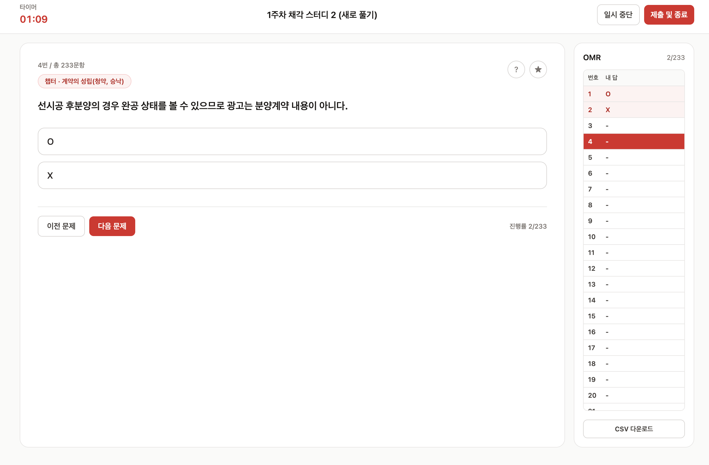
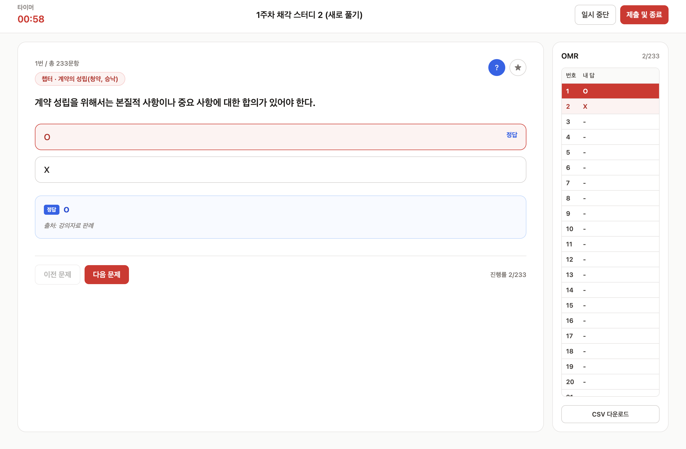
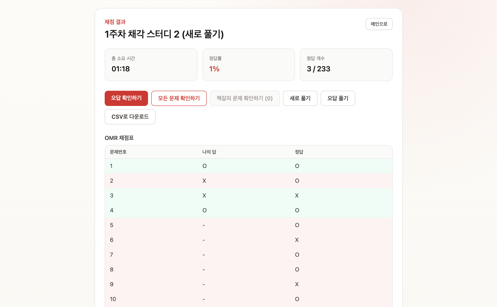
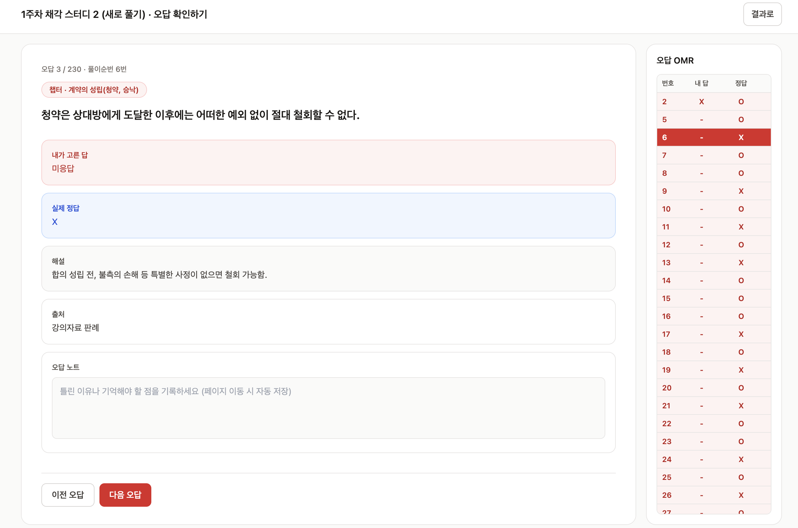

# law-solver

오프라인 CSV 문제 풀이와 계정 기반 Premium 온라인 문제 풀이를 함께 제공하는 로스쿨 문제 풀이 웹앱입니다. 오프라인 데이터는 브라우저에만 저장하고, Premium 계정·결제·온라인 학습 데이터는 별도 비공개 Supabase 서버에서 관리합니다.

License: CC BY-NC-ND  
(c) 2026 Haryun all rights reserved

## Screenshots

| 문제풀이 페이지 | 힌트 보기 |
| --- | --- |
|  |  |

| 풀이 결과 | 오답 정리 |
| --- | --- |
|  |  |

## 주요 기능

- 랜딩 페이지, 미니 앱 목록, 과목 목록, 과목별 문제 풀이 대시보드
- LBTI 30문항 테스트, 유형 계산, 공유 가능한 16개 결과 페이지와 전체 유형 탐색
- 과목 추가/편집/삭제, 5종 표지 색상 선택, 드래그 순서 변경, 문제별 과목 배정, `과목 없음` 기본 폴더
- OX, 5지선다, 단답형 CSV 업로드
- 번호 순서, 챕터별 랜덤, 전체 랜덤 풀이 순서 선택
- CBT 풀이 화면, 타이머, OMR, 모바일 Bottom Sheet
- 5지선다 박스형 지문(`박스1`, `박스2`, `box1`, `box2` 등) 표시
- 정답/해설 보기, 책갈피, 일시 중단
- 제출 후 점수, 정답률, OMR 채점표 확인
- 오답 확인, 전체 문항 확인, 책갈피 문항 확인
- 오답노트 작성 및 저장
- 오답만 다시 풀기, 전체 새로 풀기, 책갈피 문제만 다시 풀기
- 전체 결과 CSV, 오답 결과 CSV, 오답노트 CSV 다운로드
- 과목/문제/풀이 기록을 포함한 대시보드 JSON 백업, 복원, 초기화
- 다크 모드와 글꼴 설정
- Supabase Auth 이메일 회원가입·로그인, Premium 30일 회원권과 과목 이용권
- 서버 마켓플레이스의 활성 상품명·가격·기간·풀이 횟수를 반영하는 구매 카드, Premium 이용 시작일·최종 종료 예정일 표시와 active Premium 만료일 뒤로 기간을 이어 붙이는 추가 구매
- 이용권 구매 모달의 결제방법 선택, 16자리 일회용 프로모션 코드 적용과 사용자별 결제내역
- Premium·문제 유형 태그와 전체 문항·풀이 세션 수를 표시하는 온라인 문제 카드, 문제별 세션 목록 및 전체·오답·책갈피 재풀이 누적
- 오프라인 CSV와 Premium 온라인 풀이·결과·오답 확인·전체 확인이 같은 컴포넌트·박스형 지문·OMR UI 사용
- Premium 답안은 문항을 떠날 때 저장하고, 정답·해설은 `?`를 누른 현재 문항만 지연 조회
- 인증·권한·결제·네트워크 오류는 기술 원문 대신 다음 행동을 안내하는 한국어 메시지로 표시
- 일시적인 성공·오류 안내는 메뉴와 카드 레이아웃을 밀지 않는 고정 토스트로 표시
- Premium 비동기 페이지 전환은 실제 카드·풀이·결과 레이아웃을 닮은 스켈레톤과 버튼 스피너로 표시
- 계정 및 구독의 결제내역 탭은 비순차 `LS-YY########` 결제번호·상품·수단·금액·구매일시를 표시하며 프로모션 코드 원문은 보관하지 않음
- GA4 기반 정규화 페이지뷰와 비식별 주요 행동 이벤트 수집
- GitHub Pages 배포 설정과 SPA 새로고침 대응

## 기술 스택

- React 18
- TypeScript
- Vite
- Tailwind CSS
- React Router
- Zustand + localStorage persist
- Supabase JavaScript Client
- Papa Parse
- Google Analytics 4 (`gtag.js`)
- Vitest

## 저장소 구성과 브랜치

Law Solver Premium은 배포·권한 경계가 다른 두 저장소로 나눕니다.

| 저장소 | 공개 범위 | 담당 영역 | 로컬 폴더 |
| --- | --- | --- | --- |
| [`haryunio/law-solver`](https://github.com/haryunio/law-solver) | 공개 | React UI, 오프라인 CSV, 공개 Supabase client와 Premium 화면 | `law-solver/` |
| `haryunio/law-solver-server` | 비공개 | Auth/RLS, DB migration, Edge Functions, 결제, 비공개 문제 콘텐츠 | 형제 폴더 `law-solver-server/` |

프론트는 `develop`을 통합 개발 기준으로 사용하고 Premium 기능은 `feature/premium`에서 작업합니다. 서버는 `develop`에서 기능을 통합하고 검증된 상태만 `main`으로 반영합니다. 서버 CI/CD 자동화는 아직 활성화하지 않았으며 현재는 저장소의 검증 명령을 로컬에서 실행합니다.

API·DTO·권한 계약은 서버의 `docs/API.md`, `docs/AUTHORIZATION.md`, `docs/FRONTEND_INTEGRATION.md`가 기준입니다. 계약 변경은 서버 구현과 문서를 먼저 갱신한 뒤 이 저장소의 `src/lib/premiumApi.ts`와 화면을 맞추고, 각 저장소에 독립적인 커밋으로 남깁니다. 서버 콘텐츠와 secret은 프론트 저장소로 복사하지 않습니다.

## 디렉터리 구조

```txt
.
├── .github/workflows/deploy-pages.yml  # GitHub Pages 자동 배포 워크플로우
├── docs/                               # README 스크린샷 이미지
├── public/
│   ├── 404.html                        # GitHub Pages SPA redirect
│   └── CNAME                           # 커스텀 도메인: lawsolver.haryun.io
├── samples/                            # 업로드 테스트용 샘플 CSV
├── src/
│   ├── components/
│   │   ├── analytics/                  # React Router 페이지뷰 추적
│   │   ├── seo/                        # 라우트별 title, canonical, robots 메타데이터
│   │   ├── cbt/                        # CBT 풀이 UI
│   │   ├── premium/                    # Premium 결과용 문항 표시 UI
│   │   ├── review/                     # 리뷰 화면용 재사용 UI
│   │   ├── ui/                         # 브랜드, 모달, 공통 헤더/푸터 UI
│   │   └── upload/                     # CSV 업로드 UI
│   ├── mini-apps/                       # 앱별 독립 기능, manifest, 개발 문서
│   │   ├── catalog.ts                   # /apps 노출 목록과 순서
│   │   ├── lbti/                        # LBTI: 로스쿨생 MBTI 테스트
│   │   ├── statute-recall/              # 조문 리콜
│   │   ├── study-planner/               # 스터디 플래너
│   │   └── focus-timer/                 # 집중 타이머
│   ├── lib/                            # CSV, 분석, SEO, 정렬, 채점, ID, 시간 유틸 및 테스트
│   ├── pages/                          # 라우트 단위 화면
│   ├── store/                          # Zustand stores
│   ├── types/                          # 공유 타입
│   ├── App.tsx                         # 라우팅 및 테마 watcher
│   └── main.tsx                        # React entry
├── index.html                          # Vite HTML entry, GA4 태그, OG meta, SPA redirect restore
├── tailwind.config.ts
├── vite.config.ts
└── package.json
```

## 디자인 시스템

Law Solver는 랜딩부터 문제 풀이, 결과, 오답 복기 화면까지 하나의 디자인 시스템을 사용합니다.

- 기본 배경: 눈의 피로를 줄이는 미색 계열
- 표면: 따뜻한 백색 카드와 얇은 중립 테두리
- 브랜드 색상: 레드를 중심으로 한 포인트 컬러
- 강조 그라디언트: 대표 CTA와 진행률에서만 레드→주황→오렌지 사용
- 의미 색상: 정답 emerald, 오답·선택 red, 정답 안내 blue, 책갈피 amber
- 다크 모드: 같은 정보 위계와 대비를 유지하는 짙은 웜 뉴트럴 표면
- 집중 풀이 화면: 단색 레드 CTA와 90ms의 짧은 hover 색상 전환만 사용하며 이동·축소 애니메이션은 제외
- 문제 세션 카드: 흰색 표면과 아주 밝은 회색 결과 확인 영역으로 정보 구획을 분리
- 넓은 강조 패널: 브랜드 레드에서 코럴과 오렌지로 밝게 이어지는 그라디언트
- 모달 배경: 콘텐츠 식별이 가능한 2px의 약한 블러

공통 스타일은 `src/index.css`의 `app-*` 클래스에 정의되어 있습니다. `app-page`, `app-card`, `app-topbar`, `app-button-primary`, `app-button-secondary`, `app-control`, `app-modal-surface` 등을 페이지와 공통 컴포넌트에서 재사용합니다. 그라디언트 버튼은 hover 시 색상만 진해지며, 상승 효과는 단독 CTA에 `app-button-primary-standalone`을 함께 지정한 경우에만 적용됩니다. 로고는 `src/components/ui/BrandMark.tsx`가 `public/favicon.svg`를 참조하므로 파비콘과 앱 내부 브랜드가 항상 동일합니다.

공통 디자인 클래스는 색상, 테두리, 그림자와 상태 표현만 담당합니다. 위치와 크기 같은 레이아웃은 각 화면의 컴포넌트가 소유해, 공통 스타일 변경이 CBT 버튼이나 카드 배치를 덮어쓰지 않도록 합니다. 랜딩의 문제 풀이 예시는 실제 CBT의 상단 제어, 문제 카드, OMR, 하단 이동 구조를 축소해 보여 줍니다.

디자인 리팩터링은 기존 라우트, 화면 배치, 사용자 흐름과 localStorage 데이터 구조를 변경하지 않는 것을 원칙으로 합니다.

## 미니 앱 구조

미니 앱은 `src/mini-apps/<app-id>/` 아래에서 서로 독립적으로 개발합니다. `/apps` 목록은 각 폴더의 `manifest.ts`를 모은 `src/mini-apps/catalog.ts`를 사용하므로, 이름·설명·상태·출시 경로의 단일 출처가 유지됩니다.

| 앱 | 폴더 | 현재 상태 |
| --- | --- | --- |
| LBTI: 로스쿨생 MBTI 테스트 | `lbti/` | Available |
| 조문 리콜 | `statute-recall/` | Coming Soon |
| 스터디 플래너 | `study-planner/` | Coming Soon |
| 집중 타이머 | `focus-timer/` | Coming Soon |

각 폴더의 README에는 목표, 첫 번째 버전 범위, 제외 범위, 데이터 저장 방향과 출시 조건이 정리되어 있습니다. 전체 생성 순서와 의존성 규칙은 [`src/mini-apps/README.md`](src/mini-apps/README.md)를 기준으로 합니다.

LBTI의 네 지표와 16개 유형은 [`lbti-framework.json`](src/mini-apps/lbti/data/lbti-framework.json), 28개 기본 채점 문항·1개 가점 문항·1개 보조 문항은 [`questions.ko.json`](src/mini-apps/lbti/data/questions.ko.json), 제품 범위와 출시 단계는 [`PRODUCT_PLAN.md`](src/mini-apps/lbti/docs/PRODUCT_PLAN.md), 문항·결과문 작성 기준은 [`CONTENT_GUIDE.md`](src/mini-apps/lbti/docs/CONTENT_GUIDE.md)에 정리되어 있습니다.

- 앱 ID와 폴더명은 영문 kebab-case로 고정하고 URL과 저장 key에 같은 값을 사용합니다.
- 앱 전용 구현은 해당 폴더에 두고, 두 앱 이상이 실제로 공유하는 코드만 루트 공통 영역으로 이동합니다.
- 앱 저장 key는 `law-solver-mini-app:<app-id>:v1` 형식을 사용하며 기존 `law-solver-storage`와 분리합니다.
- 출시 전에는 `coming-soon` 상태와 route 없는 manifest를 사용합니다. 출시 시 `/apps/<app-id>` 라우트와 분석·개인정보 문서를 함께 갱신합니다.
- 현재 미니 앱 데이터는 Law Solver 전체 JSON 백업에 포함되지 않습니다. 백업 통합은 별도 migration 작업으로 다룹니다.

## 앱 실행 흐름

- `/`: 랜딩 페이지
- `/apps`: 미니 앱 목록
- `/apps/lbti`: LBTI 소개
- `/apps/lbti/test`: 30문항 LBTI 테스트
- `/apps/lbti/types`: 16개 전체 유형
- `/apps/lbti/result/:typeCode`: 공유 가능한 유형별 결과
- `/home`: 환경설정, 계정·구독, 온라인·오프라인 문제 풀이로 이동하는 서비스 홈
- `/settings`: 테마·글꼴 설정과 오프라인 데이터 백업/복원/초기화
- `/account`: Supabase Auth 계정과 Premium 회원권·과목 이용권
- `/premium`: 이용 가능한 온라인 Premium 과목
- `/premium/courses/:courseId`: 과목별 온라인 문제 카드
- `/premium/courses/:courseId/problem-sets/:problemSetId`: 문제별 풀이 회차와 재풀이 세션 목록
- `/premium/attempts/:attemptId`: 서버 저장형 온라인 문제 풀이
- `/premium/results/:attemptId`: 로컬 CSV와 동일한 서버 채점 결과와 재풀이
- `/premium/wrong/:attemptId`: 서버 오답 확인과 오답 노트
- `/premium/review/:attemptId`: 서버 전체·책갈피 문제 확인
- `/dashboard`: 오프라인 과목 목록과 과목 관리
- `/dashboard/:subjectId`: 과목별 세션 목록, CSV 업로드, 문제 제목/과목 편집
- `/solve/:sessionId`: CBT 풀이
- `/result/:sessionId`: 채점 결과와 재풀이/다운로드 액션
- `/wrong/:sessionId`: 오답 확인 및 오답노트 작성
- `/review/:sessionId`: 전체 문항 또는 책갈피 문항 확인

세션, 과목, 세션-과목 매핑 데이터는 `law-solver-storage` 키로 localStorage에 저장됩니다. 환경설정은 `law-solver-settings` 키로 저장됩니다.

`과목 없음`은 실제 과목 객체로 저장하지 않습니다. 세션-과목 매핑이 없는 세션을 `과목 없음`으로 표시합니다.

## Google Analytics 4

운영 사이트 `lawsolver.haryun.io`는 GA4 Google 태그를 직접 사용합니다.

- 측정 ID: `G-DRXS2G7E5F`
- 태그 설치: `index.html`
- 공통 분석 유틸: `src/lib/analytics.ts`
- SPA 페이지뷰 추적: `src/components/analytics/PageViewTracker.tsx`
- 전송 환경: 호스트명이 `lawsolver.haryun.io`인 경우에만 이벤트 전송

자동 페이지뷰는 `send_page_view: false`로 비활성화하고 React Router 이동에 맞춰 수동으로 전송합니다. 동적 과목·세션 식별자와 쿼리 문자열은 보내지 않으며 다음 화면 유형과 경로로 정규화합니다.

| `page_type` | 정규화 경로 | 화면 |
| --- | --- | --- |
| `main` | `/` | 랜딩 |
| `mini_apps` | `/apps` | 미니 앱 목록 |
| `mini_app` | `/apps/mini-app` | 개별 미니 앱 화면 |
| `app_home` | `/home` | 서비스 홈 |
| `settings` | `/settings` | 환경설정과 오프라인 데이터 관리 |
| `account` | `/account` | 계정 및 구독 |
| `premium_dashboard` | `/premium` | 온라인 Premium 대시보드 |
| `subject_dashboard` | `/dashboard` | 과목 대시보드 |
| `problem_dashboard` | `/dashboard/subject` | 문제 대시보드 |
| `solve` | `/solve` | 문제 풀이 |
| `result` | `/result` | 풀이 결과 |
| `review` | `/review` | 전체·오답·책갈피 리뷰 |

수집하는 주요 행동 이벤트는 다음과 같습니다.

| 이벤트 | 발생 시점 | 추가 구분값 |
| --- | --- | --- |
| `lbti_result_completed` | LBTI 30문항 완료 후 결과 계산 | `lbti_type` |
| `problem_upload_completed` | CSV 업로드와 세션 생성 성공 | `question_type` |
| `problem_upload_failed` | CSV 읽기 또는 파싱 실패 | `question_type`, `failure_type` |
| `solve_started` | 문제 풀이 진입 | `question_type`, `solve_entry` |
| `question_completed` | 답변한 문항을 떠날 때 문항당 1회 | `question_type`, `navigation_method` |
| `solve_paused` | 풀이 일시 중단 | `question_type` |
| `solve_completed` | 제출과 채점 완료 | `question_type` |
| `review_started` | 전체·오답·책갈피 리뷰 진입 | `question_type`, `review_type` |
| `review_question_viewed` | 리뷰에서 새 문항 확인 | `question_type`, `review_type` |
| `retry_created` | 전체·오답·책갈피 재풀이 세션 생성 | `question_type`, `retry_type` |

`question_type`은 `ox`, `multiple_choice`, `short_answer` 중 하나입니다. `lbti_type`은 LBTI의 16개 4자 유형 코드 중 하나입니다. `lbti_result_completed`는 공유 결과 페이지를 열거나 유형 목록을 살펴볼 때가 아니라 실제 테스트를 모두 완료해 결과를 계산할 때만 보냅니다. `question_completed`는 같은 풀이 방문에서 같은 문항을 앞뒤로 반복 이동해도 한 번만 보냅니다. 답변한 현재 문항은 다른 문항으로 이동하거나 제출·일시 중단할 때 기록합니다.

아래 제한은 GA4 분석 전송에 관한 기준입니다. 사용자가 올린 오프라인 CSV와 로컬 풀이 기록은 브라우저에만 저장되지만, Premium 온라인 문제는 이어 풀기·서버 채점·결과·오답·책갈피·재풀이 제공을 위해 문제 세트와 풀이 세션, 문항별 선택·입력 답안, 진행·제출 상태, 풀이 시간, 점수와 정오 결과 등이 사용자 계정에 연결되어 Supabase 기반 서버에 저장됩니다. 이 Premium 서버 저장 원본도 GA4에는 전송하지 않습니다.

다음 데이터는 GA4로 전송하지 않습니다.

- 문제 본문, 선택지, 해설, 출처와 사용자가 선택하거나 입력한 답안
- 문제 정오 여부, 점수, 진행률, 문항 수와 풀이 시간
- LBTI 질문별 응답, 축별 점수, 진행률과 소요시간
- 과목명, 세션명, CSV 파일명
- `subjectId`, `sessionId`, 문항 ID를 포함한 식별자
- localStorage에 저장된 학습 데이터 원본

GA4 데이터 스트림의 향상된 측정에서 `브라우저 방문 기록 이벤트에 따른 페이지 변경`은 꺼야 합니다. 이 설정이 켜져 있으면 수동 `page_view`와 중복 집계될 수 있습니다. 배포 후 DebugView에서 이벤트가 한 번씩 발생하는지 확인하고, 보고서에서 세부 구분값을 사용하려면 `page_type`, `question_type`, `solve_entry`, `navigation_method`, `review_type`, `retry_type`, `failure_type`, `lbti_type`을 이벤트 범위 맞춤 측정기준으로 등록합니다. `solve_completed`는 주요 이벤트로 지정할 수 있습니다.

## Google Search Console과 SEO

운영 도메인은 Search Console 도메인 속성 `lawsolver.haryun.io`를 기준으로 관리합니다. 검색에 노출할 공개 URL과 개인 학습 화면을 분리하며, 관련 정책은 `src/lib/seo.ts`가 단일 출처입니다.

- 색인 대상: 랜딩, 과목 대시보드, 미니 앱 목록, LBTI 소개, 16개 유형 목록, 16개 유형별 결과
- 색인 제외: 서비스 홈, 환경설정, 계정·구독, Premium 대시보드, LBTI 응답 화면, 과목별 문제 대시보드, 풀이, 채점 결과와 리뷰, 알 수 없는 경로
- `src/components/seo/RouteMetadata.tsx`가 React Router 이동 시 title, description, canonical, robots, Open Graph와 Twitter 메타데이터를 갱신합니다.
- 메인 title은 `Law Solver`이며 세부 화면은 `Law Solver | 대시보드`처럼 브랜드명 뒤에 1뎁스 기능명만 붙입니다.
- `index.html`에는 운영 도메인 canonical, 기본 소셜 메타데이터와 `WebApplication` JSON-LD가 들어 있습니다.
- `vite.config.ts`가 빌드할 때 `dist/robots.txt`, `dist/sitemap.xml`과 공개 하위 경로별 `index.html`을 생성합니다.
- 사이트맵에는 정규 URL만 절대 URL로 넣고, 세션·과목·문항 식별자나 쿼리 문자열은 넣지 않습니다.
- `public/og-image.png`는 외부 서비스의 넓은 링크 프리뷰 이미지입니다. Open Graph와 Twitter 메타데이터에는 이미지 주소, 크기, 형식과 대체 문구를 함께 제공합니다.

GitHub Pages는 존재하지 않는 SPA 하위 경로에 HTTP 404를 반환하므로, 검색에 노출할 고정 경로와 LBTI 유형 결과는 빌드 시 각각의 HTML 앱 셸을 생성해 직접 요청에도 HTTP 200이 되도록 합니다. 비공개 학습 경로는 기존 SPA 복구 흐름을 유지하면서 런타임에 `noindex`를 적용합니다.

배포 후 `https://lawsolver.haryun.io/robots.txt`와 `https://lawsolver.haryun.io/sitemap.xml`이 200으로 열리는지 확인하고, Search Console의 `Sitemaps`에서 `sitemap.xml`을 제출합니다. 제출은 크롤링 힌트이며 색인을 보장하지 않으므로, URL 검사에서는 대표 공개 URL의 라이브 테스트와 실제 canonical 선택도 함께 확인합니다.

## 설치 방법

```bash
npm install
```

CI나 재현 가능한 설치가 필요할 때는 lockfile 기준으로 설치합니다.

```bash
npm ci
```

## 환경변수 설정

오프라인 기능만 사용할 때 필수 환경변수는 없습니다. Premium 온라인 기능을 연결하려면 `.env.example`을 복사하고 공개 가능한 Supabase URL과 publishable key를 설정합니다.

```bash
cp .env.example .env.local
```

```dotenv
VITE_SUPABASE_URL=http://127.0.0.1:54321
VITE_SUPABASE_PUBLISHABLE_KEY=<law-solver-server의 npm run status 출력값>
```

`service_role`/secret key, 데이터베이스 비밀번호와 Toss secret key는 프론트 환경변수에 넣지 않습니다. GA4 측정 ID도 공개 식별자이며 비밀키로 취급하지 않습니다.

환경변수를 추가해야 하는 기능을 만들 때는 Vite 관례에 따라 클라이언트에 노출 가능한 값만 `VITE_` 접두사를 사용하세요. 비밀키나 서버 전용 시크릿은 이 프로젝트의 프론트엔드 번들에 넣으면 안 됩니다.

## 개발 서버 실행

```bash
npm run dev
```

기본 접속 주소는 Vite 기본값인 `http://localhost:5173`입니다.

Premium 로컬 연동은 먼저 형제 저장소 `law-solver-server`에서 Supabase와 Edge Functions를 실행해야 합니다. 자세한 순서는 서버 저장소의 `docs/LOCAL_DEVELOPMENT.md`를 따릅니다.

## 빌드와 배포

프로덕션 빌드:

```bash
npm run build
```

로컬에서 빌드 결과 미리보기:

```bash
npm run preview
```

GitHub Pages 배포:

- `.github/workflows/deploy-pages.yml`이 `main` 브랜치 push 또는 수동 실행(`workflow_dispatch`) 시 동작합니다.
- 워크플로우는 `npm ci`, `npm run build` 후 `dist`를 Pages artifact로 업로드합니다.
- `public/CNAME`에 `lawsolver.haryun.io`가 설정되어 있습니다.
- `public/404.html`과 `index.html`의 redirect restore 스크립트로 GitHub Pages에서 SPA 라우트 새로고침 404를 우회합니다.
- 검색에 노출하는 공개 하위 경로는 `vite.config.ts`가 별도 `index.html`을 만들어 직접 요청도 200으로 응답합니다.
- `robots.txt`와 `sitemap.xml`은 수동 편집 파일이 아니라 `src/lib/seo.ts`의 정책에서 빌드 시 생성됩니다.

## 데이터 백업/복원

`/settings`의 `오프라인 데이터` 탭에서 수행하는 백업/복원은 과목별이 아니라 현재 브라우저의 전체 오프라인 데이터베이스 단위입니다. 백업은 다음 데이터를 하나의 JSON으로 저장합니다.

- 문제 세션과 유저 답안
- 과목 목록
- 과목별 표지 색상과 표시 순서
- 세션-과목 매핑
- 오답노트와 책갈피

현재 백업 포맷은 객체 형태입니다.

```json
{
  "app": "law-solver",
  "version": 2,
  "exported_at": "2026-07-01T00:00:00.000Z",
  "sessions": [],
  "subjects": [],
  "sessionSubjectMap": {}
}
```

이전 버전의 배열 형태 백업도 복원할 수 있습니다. 구형 백업을 복원하면 모든 세션은 `과목 없음`으로 들어갑니다.

## 테스트와 린트

테스트:

```bash
npm test
```

Watch 모드:

```bash
npm run test:watch
```

린트:

```bash
npm run lint
```

현재 `package.json`에는 `lint` 스크립트가 없습니다. 필요하면 ESLint 설정과 함께 추가해야 합니다.

## CSV 형식

업로드는 UTF-8(BOM 포함/미포함), EUC-KR(CP949) CSV를 자동 감지해 읽습니다. 다운로드 CSV는 Excel 호환을 위해 UTF-8 BOM과 CRLF 줄바꿈으로 생성합니다.

새 문제 등록에서 CSV 파일을 선택하면 확장자를 제외한 파일명이 세션 제목으로 입력됩니다. 파일명의 특수문자는 공백으로 바뀌며 연속 공백은 하나로 정리됩니다. 선택지 헤더가 있으면 5지선다로, 선택지 헤더가 없고 정답이 모두 O/X 계열이면 OX로, 그 밖의 정답 문자열은 단답형으로 자동 선택합니다. 형식을 판별할 수 없으면 현재 선택한 문제 타입을 유지합니다.

문제·보기·선지·해설에는 표, 줄바꿈, 문단, 목록, 강조, 위첨자·아래첨자 등 제한된 HTML을 사용할 수 있습니다. 해당 HTML은 허용된 문서 태그만 React 요소로 변환하며 스크립트, iframe, 폼, 이미지, 이벤트 속성 및 임의 스타일은 제거합니다. 표는 별도 가로 스크롤 없이 문제 카드 너비에 맞춰 표시됩니다.

CSV의 큰따옴표로 감싼 셀 안에 실제 줄바꿈이 있으면 해당 개행을 유지합니다. 특히 여러 선지를 설명하는 해설은 각 줄을 화면의 명시적인 줄바꿈으로 표시합니다.

### OX

```csv
번호,챕터,문제,정답,해설,출처
```

- `정답`: `O` 또는 `X`

### 5지선다

```csv
번호,챕터,문제,선택지1,선택지2,선택지3,선택지4,선택지5,정답,해설,출처
```

- `정답`: `1`부터 `5`
- `선택지` 대신 `지문`, `선지`, `choice`, `option` 계열 헤더도 일부 호환됩니다.
- 박스형 지문은 `박스1`, `박스2` 또는 `box1`, `box2` 같은 헤더로 추가할 수 있습니다.

### 단답형

```csv
번호,챕터,문제,정답,해설,출처
```

- `정답`: 문자열 그대로 비교합니다.

개발·수동 테스트용 샘플은 `samples/` 디렉터리에 있습니다. 랜딩에서 내려받는 배포용 샘플은 `public/samples/`에 있으며 OX, 일반 5지선다, 박스형 5지선다, 단답형을 각각 제공합니다.

## 현재 알려진 제한사항 / TODO

- 오프라인 CSV 문제와 풀이 기록은 브라우저 localStorage에만 저장됩니다. 브라우저 데이터 삭제, 다른 기기 사용, 시크릿 모드에서는 유지되지 않을 수 있습니다.
- Premium 온라인 문제의 콘텐츠와 사용자별 답안·진행 상태·결과·책갈피·오답 노트·재풀이 기록은 온라인 기능 제공을 위해 Supabase 기반 서버에 저장되며 오프라인 JSON 백업 범위에는 포함되지 않습니다.
- 오프라인의 중요한 풀이 기록은 대시보드 JSON 백업 또는 CSV 다운로드로 별도 보관해야 합니다. Premium 문제와 풀이 결과는 콘텐츠 보호를 위해 CSV 다운로드를 제공하지 않습니다.
- Premium 기능은 비공개 `law-solver-server`와 공개 Supabase 연결값이 설정된 환경에서만 동작합니다.
- 과목 삭제 시 문제 세션은 삭제되지 않고 `과목 없음`으로 이동합니다.
- 단답형 채점은 현재 문자열 일치 기반입니다. 띄어쓰기, 대소문자, 동의어 처리 같은 정규화는 제한적입니다.
- `npm run lint`는 아직 제공되지 않습니다. 린트 도입이 필요하면 별도 설정이 필요합니다.
- `public/CNAME`은 `lawsolver.haryun.io` 기준입니다. GitHub 기본 도메인(`https://haryunio.github.io/law-solver/`)으로만 운영할 경우 CNAME과 Vite base 설정을 함께 점검해야 합니다.

## 확인한 명령어

- `npm test`: 통과, 16개 테스트 파일 / 60개 테스트
- `npm run build`: 통과
